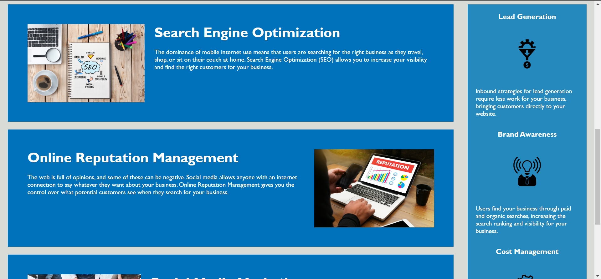
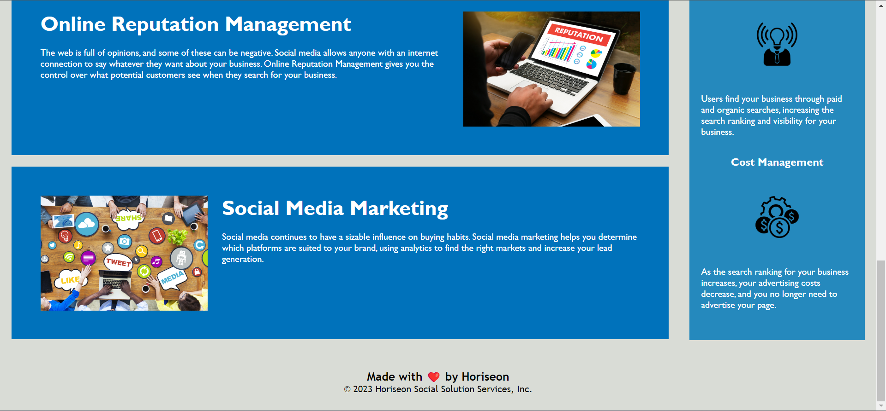

# 01 HTML, CSS, and Git: Code Refactor

## Description

A marketing agency wants a codebase that follows accessibilty standards so that their website is optimized for search engines. 
The site has sections of information covering the topics of search engine optimization (SEO), online reputation management, and social media marketing.
Also then describing the benefits that optimizing SEO can provide for a business.

## Screenshots

